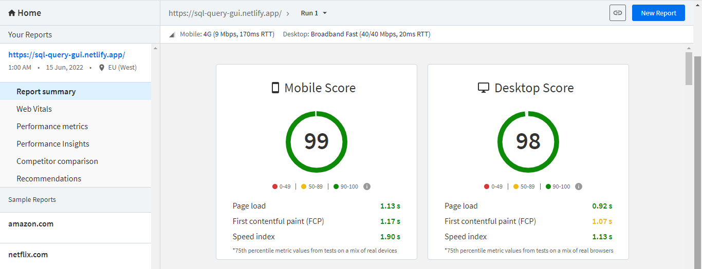

# 🚀 REACT SQL-QUERY-QUI Editor

This is a REACT SQL-Query-GUI Editor built using ReactJs, JSON Server and CSS.

Try out the website : [REACT SQL-Query-GUI Editor](https://sql-query-gui.netlify.app/)

## 👨‍🔧 Tech Stack

:white_check_mark: User can write a Query and click submit to get data from the application .\
:white_check_mark: Users can use the select option and click on Get Query to get a some selected record based on what the user select\

## ✍️ Predefined SQL Queries

- `SELECT * from categories`
- `SELECT * from customers`
- `SELECT * from employees`
- `SELECT * from orders`
- `SELECT * from products`
- `SELECT * from regions`
- `SELECT * from shippers`
- `SELECT * from suppliers`

## ⏱ Page Load Time

Page Load time of this website in desktop is in the range of 0.4 s to 0.6s.

I calculated the performance and load time of this website using these two tools Lighthouse Chrome DevTools and BrowserStack SpeedLab.

### [Lighthouse Chrome DevTools Report](https://developers.google.com/web/tools/lighthouse#devtools) (got a perfect 💯)

- **First Contentful Paint** marks the time at which the first text or image is painted
- **Time to interactive** is the amount of time it takes for the page to become fully interactive.
- **Speed Index** shows how quickly the contents of a page are visibly populated.
- **Total Blocking Time** is the sum of all time periods between FCP and Time to Interactive, when task length exceeded 50ms, expressed in milliseconds.
- **Largest Contentful Paint** marks the time at which the largest text or image is painted.
- **Cumulative Layout Shift** measures the movement of visible elements within the viewport.

### [BrowserStack Report](https://www.browserstack.com/speedlab)

## Available Scripts

In the project directory, you can run:

### `yarn start`

Runs the app in the development mode.\
Open [http://localhost:3000](http://localhost:3000) to view it in the browser.

The page will reload if you make edits.\
You will also see any lint errors in the console.

### `yarn build`

Builds the app for production to the `build` folder.\
It correctly bundles React in production mode and optimizes the build for the best performance.

The build is minified and the filenames include the hashes.\
Your app is ready to be deployed!

See the section about [deployment](https://facebook.github.io/create-react-app/docs/deployment) for more information.
